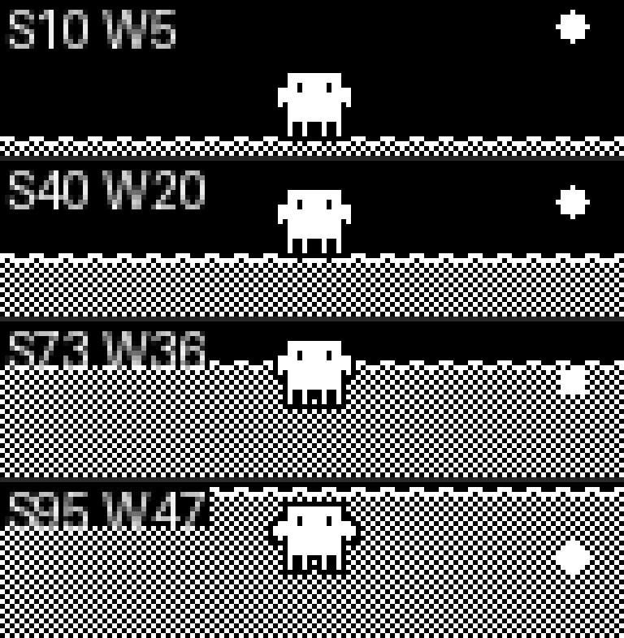
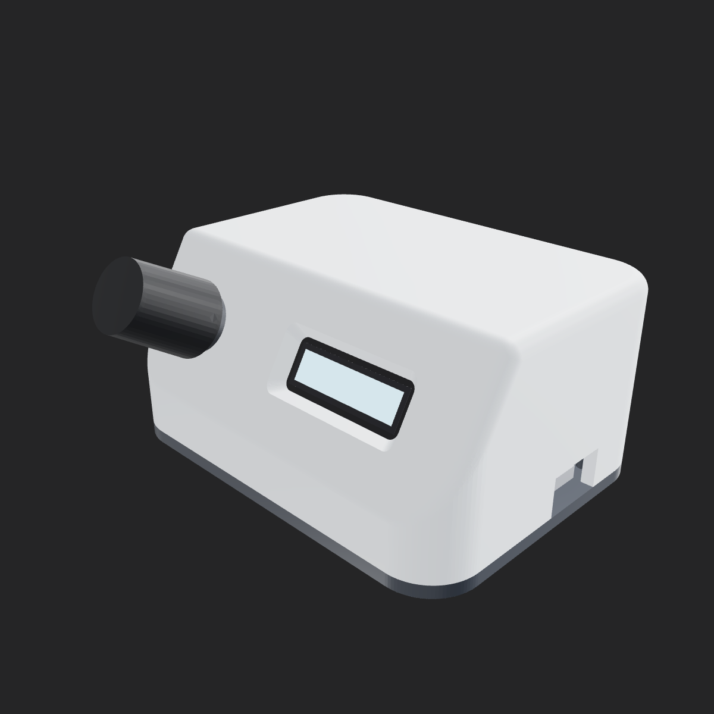

# Clawdmeter

A small ESP32 dashboard I made for my desk to keep an eye on Claude Code usage.

It runs on a plain **ESP32-WROOM-32** dev board driving a **128×32 SSD1306
monochrome OLED**, with an **EC11 rotary encoder** for input. A host daemon
polls your Claude usage and pushes it to the display over Bluetooth. The usage
view has two looks: a plain two-row meter, and a playful "Claude's day" scene
where the session quota is a rising dithered tide, the weekly quota is a setting
sun, and a little Clawd creature floats on the water and starts to fret as you
approach your limit.



The Clawd sprite comes from [claudepix](https://claudepix.vercel.app),
[@amaanbuilds](https://x.com/amaanbuilds)'s library of pixel-art Clawd sprites —
check it out, it's lovely.

> **Single-board personal fork.** This tree is a fork of
> [HermannBjorgvin/Clawdmeter](https://github.com/HermannBjorgvin/Clawdmeter)
> narrowed to one device. Upstream's Waveshare AMOLED/LCD board ports have been
> dropped to keep it focused. The multi-board HAL boundary is still intact
> (`main.cpp`, `ui.cpp`, and `splash.cpp` never see board-specific code), so a
> port can be re-added as a new folder — see
> [`docs/porting/adding-a-board.md`](docs/porting/adding-a-board.md).

## Controls

Everything is driven by the rotary encoder — turn to move, push to select.

- **On the usage view:** turn to switch between the two display modes (the
  two-row meter and the playful "Claude's day" scene); push to open the settings
  menu.
- **In the menu:** turn to move the selection, push to activate. The menu
  auto-closes after a few seconds of inactivity.

Menu items: **Refresh now** (ask the daemon for fresh data), **Brightness**
(push, then turn to adjust), **Re-pair** (clear the saved Bluetooth bond and
re-advertise), **Sleep display**, **Back**. The display also sleeps on its own
after a while; any turn or press wakes it.

## Hardware

A single board, all over one I2C bus plus three encoder pins:

| Part | Connection |
| ---- | ---------- |
| **ESP32-WROOM-32** dev board | USB (CP2102/CH340 UART bridge) |
| **SSD1306 128×32 OLED** | I2C — SDA `GPIO 21`, SCL `GPIO 22` (address auto-probed `0x3C` → `0x3D`) |
| **EC11 rotary encoder** | A `GPIO 32`, B `GPIO 33`, switch `GPIO 23` — commons to GND, internal pullups |

The encoder pin mapping lives in `firmware/src/boards/esp32_ssd1306/board.h`. If
you wire yours differently, adjust the `ENC_PIN_*` defines (the `encdbg` serial
command reports which GPIO is which — rotate and the A/B pins toggle, press and
the switch reads LOW), and flip `ENC_REVERSED` if clockwise registers as
counter-clockwise.

This is a display-only port: no touch, no battery, no IMU, no HID keys.

**Porting to another board:** the firmware is a thin HAL with per-board folders
under `firmware/src/boards/`. Drop in a new folder and a new PlatformIO env —
`main.cpp`, `ui.cpp`, and `splash.cpp` never need to change. See
[`docs/porting/adding-a-board.md`](docs/porting/adding-a-board.md) for the
walk-through and [`docs/porting/hal-contract.md`](docs/porting/hal-contract.md)
for the interfaces a port must implement.

## Case

There's a 3D-printable enclosure for the ESP32-WROOM-32 + SSD1306 + EC11 build in
[`case/`](case/) — a sloped-front desktop console with the OLED and a
rotary-encoder knob on the front facet and a removable base plate. It's a
parametric [ForgeCAD](https://forgecad.io) model (`.forge.js`), so you can tweak
dimensions and re-export rather than editing a mesh.



Quick start (see [`case/README.md`](case/README.md) for the full print guide,
fit-test coupons, and hardware list):

```bash
npm install -g forgecad
# Print the three parts (Body, Base Plate, OLED Retainer) — OCCT backend is required for the fillets:
forgecad export stl case/enclosure.forge.js --backend occt --param "Export Part=Body" --output body.stl
```

## Prerequisites

- Linux (tested on Ubuntu), macOS, or Windows 10/11
- [PlatformIO CLI](https://docs.platformio.org/en/latest/core/installation/index.html)
- Linux: `curl`, `bluetoothctl`, `busctl` (BlueZ Bluetooth stack)
- macOS: Xcode Command Line Tools (`xcode-select --install`) for `swift` + `codesign`; optionally `blueutil` (`brew install blueutil`) to auto-forget a stale bond after a reflash
- Windows: `python3` 3.11+ (the installer sets up a venv with `bleak`, `httpx`, and `pystray`)
- Claude Code with an active subscription

## macOS installation

### Flash the firmware

The WROOM-32 talks over a UART bridge, so its port is `/dev/cu.usbserial-*` (or
`/dev/cu.SLAB_USBtoUART`) — **pass it explicitly**, since `flash-mac.sh`'s
auto-detect only looks for the native-USB `/dev/cu.usbmodem*`:

```bash
./flash-mac.sh esp32_ssd1306 /dev/cu.usbserial-0001
```

Run `./flash-mac.sh` with no args to see the available envs (scraped from
`firmware/platformio.ini`).

### Pair the device

After flashing, open **System Settings → Bluetooth** and click *Connect* next to
"Clawdmeter". The daemon only ever connects to the peripheral this Mac is
paired/connected to — it never scans for a nearby device — so once it's connected
here the daemon picks it up on its next poll (~60 s).

### Install the daemon

The macOS daemon is a native Swift / CoreBluetooth binary run under launchd. It
reads your Claude OAuth token from the Keychain (service `Claude Code-credentials`),
polls usage every 60 s, and pushes it to the display over BLE.

```bash
./install-mac.sh
```

The installer builds the Swift package in `daemon/ClawdmeterDaemon/`, ad-hoc-signs
the binary (the signature carries its own Bluetooth-permission identity via an
embedded `Info.plist`, so the TCC grant sticks across launches), installs it to
`daemon/clawdmeter-daemon`, renders a LaunchAgent into
`~/Library/LaunchAgents/com.user.claude-usage-daemon.plist`, and loads it. The
first run is interactive so macOS can prompt for Bluetooth permission.

Useful commands:

```bash
launchctl list | grep claude-usage                                          # check it's running
tail -F ~/Library/Logs/claude-usage-daemon.out.log                          # live logs
launchctl unload ~/Library/LaunchAgents/com.user.claude-usage-daemon.plist  # stop
launchctl load -w ~/Library/LaunchAgents/com.user.claude-usage-daemon.plist # start
```

## Linux installation

### Flash the firmware

The WROOM-32's UART bridge shows up as `/dev/ttyUSB0` (not the `/dev/ttyACM0`
that the S3/C6 native-USB boards use), so pass it explicitly:

```bash
./flash.sh esp32_ssd1306 /dev/ttyUSB0
```

Run `./flash.sh` with no args to see the available envs (scraped from
`firmware/platformio.ini`).

### Pair the device

After flashing, the device advertises as "Clawdmeter". Pair it once:

```bash
# Scan for the device
bluetoothctl scan le

# When "Clawdmeter" appears, pair and trust it
bluetoothctl pair F4:12:FA:C0:8F:E5    # use your device's MAC
bluetoothctl trust F4:12:FA:C0:8F:E5
```

To re-pair later, use the **Re-pair** item in the on-device menu — it clears the
saved bond and re-advertises.

### Install the daemon

The daemon polls your Claude usage every 60 seconds and sends it to the display
over BLE.

```bash
./install.sh
systemctl --user start claude-usage-daemon
```

Check status: `systemctl --user status claude-usage-daemon`

View logs: `journalctl --user -u claude-usage-daemon -f`

## Windows installation

Runs natively on Windows — no WSL required. A system-tray app polls your usage
and pushes it over BLE, and starts automatically at login.

### Prerequisites

- **Native Windows** (not WSL).
- **Python 3.11+** from [python.org](https://www.python.org/downloads/) — check *"Add python.exe to PATH"* during install.
- **Claude Code** installed, with `claude login` completed. The token is read from `%USERPROFILE%\.claude\.credentials.json` (falling back to `%LOCALAPPDATA%\Claude\` then `%APPDATA%\Claude\`).
- The repo on a **native Windows path** (e.g. `%USERPROFILE%\Clawdmeter`), **not** a `\\wsl$` share — the installer refuses a WSL path.

### Flash the firmware

```powershell
pio run -d firmware -e esp32_ssd1306 -t upload --upload-port COM5   # use your device's COM port
```

Run `pio run -d firmware` with no env to see the available board envs.

### Pair the device

Pair it once: **Settings → Bluetooth & devices → Add device → Bluetooth**, then
select "Clawdmeter". Pairing keeps a persistent connection, so the device keeps
showing your last-synced usage even after the daemon quits. To undo, use **Remove
device**.

### Install the daemon (recommended)

From the repo root in PowerShell:

```powershell
powershell -ExecutionPolicy Bypass -File install-windows.ps1
```

This creates a venv, installs `bleak`/`httpx`/`pystray`/`Pillow` from the in-repo
requirements (no internet downloads), registers a per-user login-autostart entry
(`HKCU\…\Run`, no admin needed), and launches the tray app headlessly (no console
window).

### Run manually instead (optional)

```powershell
python -m venv .venv
.venv\Scripts\Activate.ps1        # if blocked: Set-ExecutionPolicy -Scope CurrentUser RemoteSigned, then retry
pip install -r daemon\requirements-windows.txt
python daemon\claude_usage_daemon_windows.py        # runs in the foreground; Ctrl+C to stop
```

### Tray icon and menu

The icon's corner bubble shows state — **green** Connected, **amber** Scanning,
**red** Error — and hovering shows the status (`Connected · last update HH:MM`).
A notification fires once when it enters Error (e.g. an expired token).
Right-click for the menu:

- **Status header** — live state + last sync time.
- **Start at login** — toggle autostart on/off.
- **Quit** — stops the daemon cleanly; leaves the Windows pairing intact (device keeps its last reading).

### Logs and troubleshooting

```powershell
Get-Content $env:LOCALAPPDATA\Clawdmeter\daemon.log -Tail 30        # view logs
reg delete "HKCU\Software\Microsoft\Windows\CurrentVersion\Run" /v Clawdmeter /f   # remove autostart
```

| Symptom | Fix |
|---------|-----|
| `Device not found` | Power on the device; make sure it's in range and paired. |
| `token expired` toast / `API HTTP 401` | Re-run `claude login`, then restart the daemon. |
| `Connection failed` | Toggle Windows Bluetooth off/on in Settings. |
| `Warning: running under Linux/WSL` | Run from a native PowerShell window, not a WSL shell. |

## How it works

1. The daemon reads your Claude Code OAuth token — from the macOS Keychain (service `Claude Code-credentials`) on macOS, or from `~/.claude/.credentials.json` on Linux (`%USERPROFILE%\.claude\.credentials.json` on Windows).
2. It makes a minimal API call to `api.anthropic.com/v1/messages` — one token of Haiku, basically free.
3. The usage numbers come straight out of the response headers (`anthropic-ratelimit-unified-5h-utilization` and friends).
4. The daemon connects to the ESP32 over BLE and writes a JSON payload to the GATT RX characteristic.
5. The firmware parses it and updates the LVGL dashboard.
6. In the playful "Claude's day" mode, the session quota drives the tide height and the Clawd creature starts to fret once you cross ~80%.

## BLE protocol

The device exposes a custom GATT data service. It also advertises the standard
HID keyboard service — not because it sends any keys (it doesn't; there are no
HID buttons on this board), but because macOS auto-connects HID peripherals and
that's what makes the daemon's `retrieveConnectedPeripherals` discovery path work.

|                            | UUID                                   |
| -------------------------- | -------------------------------------- |
| **Data Service**           | `4c41555a-4465-7669-6365-000000000001` |
| RX Characteristic (write)  | `4c41555a-4465-7669-6365-000000000002` |
| TX Characteristic (notify) | `4c41555a-4465-7669-6365-000000000003` |
| **HID Service**            | `00001812-0000-1000-8000-00805f9b34fb` |

JSON payload format (written to RX):

```json
{ "s": 45, "sr": 120, "w": 28, "wr": 7200, "st": "allowed", "ok": true }
```

Fields: `s` = session %, `sr` = session reset (minutes), `w` = weekly %, `wr` = weekly reset (minutes), `st` = status, `ok` = success flag.

## Recompiling fonts

The `firmware/src/font_*.c` files are pre-compiled LVGL bitmap fonts.

```bash
npm install -g lv_font_conv
```

Generate each one (one at a time — `lv_font_conv` doesn't like loop-driven invocations) with `--no-compress` (required for LVGL 9):

```bash
# Tiempos Text (titles) — 56 and 34px
for size in 56 34; do
  lv_font_conv --font assets/TiemposText-400-Regular.otf -r 0x20-0x7E \
    --size $size --format lvgl --bpp 4 --no-compress \
    -o firmware/src/font_tiempos_${size}.c --lv-include "lvgl.h"
done

# Styrene B (numbers, labels, and the tiny 128×32 layout) — 48 down to 12px
for size in 48 28 24 20 16 14 12; do
  lv_font_conv --font assets/StyreneB-Regular.otf -r 0x20-0x7E \
    --size $size --format lvgl --bpp 4 --no-compress \
    -o firmware/src/font_styrene_${size}.c --lv-include "lvgl.h"
done

# DejaVu Sans Mono (with spinner Unicode chars) — 32 and 18px
for size in 32 18; do
  lv_font_conv --font assets/DejaVuSansMono.ttf \
    -r 0x20-0x7E,0xB7,0x2026,0x2722,0x2733,0x2736,0x273B,0x273D \
    --size $size --format lvgl --bpp 4 --no-compress \
    -o firmware/src/font_mono_${size}.c --lv-include "lvgl.h"
done
```

**Important:** `lv_font_conv` v1.5.3 outputs LVGL 8 format. Each generated file must be patched for LVGL 9 compatibility:

1. Remove `#if LVGL_VERSION_MAJOR >= 8` guards around `font_dsc` and the font struct
2. Remove the `.cache` field from `font_dsc`
3. Add `.release_glyph = NULL`, `.kerning = 0`, `.static_bitmap = 0` to the font struct
4. Add `.fallback = NULL`, `.user_data = NULL` to the font struct

Without these patches, fonts compile but render as invisible.

## Splash / creature animations

The Clawd sprites come from [claudepix.vercel.app](https://claudepix.vercel.app),
a library of pixel-art Clawd animations. `tools/scrape_claudepix.js` evaluates the
site's JavaScript in a Node VM to pull out frame data and palettes, then
`tools/convert_to_c.js` turns everything into RGB565 C arrays and writes
`firmware/src/splash_animations.h`. The creature that floats in the playful
"Claude's day" mode is drawn from these.

To re-pull (e.g. when the source library updates):

```bash
node tools/scrape_claudepix.js
node tools/convert_to_c.js
pio run -d firmware -e esp32_ssd1306 -t upload
```

See `tools/README.md` for details. For fast offline iteration on the 128×32
output, `tools/mini_sim.py` renders creatures and the playful scene applying the
exact 1-bit threshold the panel uses — no flash, no hardware
(`python3 tools/mini_sim.py playful`).

## Credits

- Pixel-art Clawd animation by [@amaanbuilds](https://x.com/amaanbuilds), sourced from [claudepix.vercel.app](https://claudepix.vercel.app). Frame data and palettes scraped + converted by the tooling in `tools/`.
- Anthropic brand fonts (Tiempos Text, Styrene B) — see licensing warning below.

## Licensing gray area warning

The software in this repository uses and adheres to the Anthropic brand guidelines and uses the same proprietary fonts that Anthropic has a license for but this software uses without permission as well as using assets from Anthropic such as the copyrighted Clawd mascot so even though the code in this repo is non-proprietary I will not license it myself under a copyleft license since this repo includes proprietary fonts and copyrighted assets. Please be aware of this if you fork or copy the code from this repo. **You have been warned!**
